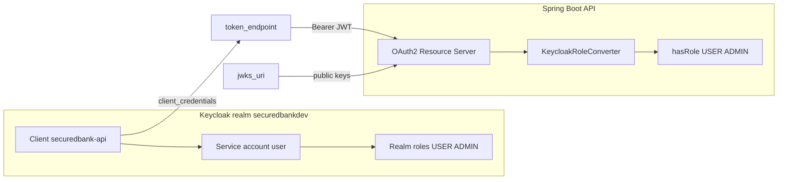

# Secured Bank

## Frontend

## Backend

Using Spring Boot and Gradle to build the backend.

### Spring Security

The backend is an **OAuth2 Resource Server**. It does not log users in; it validates JWTs sent in the `Authorization: Bearer ...` header and enforces roles.

Keycloak runs locally via Docker Compose (`securedbank-api/compose.yml`, Keycloak 26.7.0 on port 8180). Realm and client configuration is managed with OpenTofu in `infra/`.



#### Keycloak concepts

| Concept | Value in this project | Purpose |
|--------|------------------------|---------|
| **Realm** | `securedbankdev` | Isolated security domain (users, clients, roles, signing keys) |
| **Client** | `securedbank-api` | Confidential OpenID Connect client for machine-to-machine access |
| **Service account user** | `service-account-securedbank-api` | Virtual Keycloak user tied to the client for `client_credentials` grants |
| **Realm roles** | `USER`, `ADMIN` | Assigned to the service account and mapped into JWT `realm_access.roles` |

OpenTofu (`infra/main.tf`) configures the client as **M2M-only**:

- `service_accounts_enabled = true` — enables the service account user
- `standard_flow_enabled = false` — browser login via `authorization_endpoint` is disabled
- `direct_access_grants_enabled = false` — resource-owner password grant is disabled
- `full_scope_allowed = false` — roles must be explicitly mapped into tokens via `keycloak_generic_role_mapper`

Role flow into Spring Security:

1. OpenTofu creates realm roles (`USER`, `ADMIN`)
2. Roles are assigned to the service account user
3. Role mappers include them in the access token under `realm_access.roles`
4. `KeycloakRoleConverter` maps `USER` → `ROLE_USER` for `hasRole("USER")` checks

#### OpenID endpoints

All URLs are published from OpenID discovery:

```bash
curl http://localhost:8180/realms/securedbankdev/.well-known/openid-configuration
```

OpenTofu outputs these values (`make tf-outputs`):

| Output | Local URL | Used by |
|--------|-----------|---------|
| [realm](securedbankdev) | `securedbankdev` | Tenant name in every Keycloak URL |
| [client_id](securedbank-api) | `securedbank-api` | Token requests; appears in JWT as `azp` / `client_id` |
| [issuer_uri](http://localhost:8180/realms/securedbankdev) | `http://localhost:8180/realms/securedbankdev` | JWT `iss` claim; Spring can use `issuer-uri` for auto-discovery |
| [jwks_uri](http://localhost:8180/realms/securedbankdev/protocol/openid-connect/certs) | `http://localhost:8180/realms/securedbankdev/protocol/openid-connect/certs` | **Spring Boot today** — public keys for JWT signature validation (`spring.security.oauth2.resourceserver.jwt.jwk-set-uri`) |
| [token_endpoint](http://localhost:8180/realms/securedbankdev/protocol/openid-connect/token) | `http://localhost:8180/realms/securedbankdev/protocol/openid-connect/token` | Clients request tokens (`grant_type=client_credentials` for M2M) |
| [authorization_endpoint](http://localhost:8180/realms/securedbankdev/protocol/openid-connect/auth) | `http://localhost:8180/realms/securedbankdev/protocol/openid-connect/auth` | Browser/OAuth login redirect (not enabled for the current M2M client) |
| [userinfo_endpoint](http://localhost:8180/realms/securedbankdev/protocol/openid-connect/userinfo) | `http://localhost:8180/realms/securedbankdev/protocol/openid-connect/userinfo` | Returns profile claims for human user tokens (returns 403 for service-account tokens) |

#### Spring Boot integration

JWT validation is configured in `securedbank-api/src/main/resources/application.yaml`:

```yaml
spring.security.oauth2.resourceserver.jwt.jwk-set-uri: http://localhost:8180/realms/securedbankdev/protocol/openid-connect/certs
```

Protected routes (non-prod) in `ProjectSecurityNonProdConfig`:

| Endpoint | Access |
|----------|--------|
| `/notices`, `/contact`, `/error`, `/register` | Public |
| `/myAccount`, `/myCards` | `ROLE_USER` |
| `/myBalance` | `ROLE_USER` or `ROLE_ADMIN` |
| `/myLoans`, `/user` | Authenticated |

Validated behavior with a Keycloak M2M token:

| Request | Token | Result |
|---------|-------|--------|
| `GET /notices` | none | 200 (public) |
| `GET /myAccount` | none | 401 (JWT required) |
| `GET /myAccount` | invalid JWT | 401 |
| `GET /myAccount` | valid JWT | Passes auth/roles (400 if required `email` query param is missing) |

#### Commands

```bash
# Start PostgreSQL and Keycloak
make db-up

# Apply Keycloak configuration (set TF_VAR_* env vars first)
make tf-start

# Print OpenTofu outputs
make tf-outputs

# Request a client_credentials token (uses Makefile defaults for local dev)
make test-client

# Call a protected endpoint
curl -H "Authorization: Bearer <access_token>" \
  "http://localhost:8080/myAccount?email=someone@example.com"
```

Required environment variables for OpenTofu (copy `infra/terraform.tfvars.example` to `infra/terraform.tfvars`):

- `TF_VAR_keycloak_url` — default `http://localhost:8180`
- `TF_VAR_realm` — default `securedbankdev`
- `TF_VAR_client_id` — default `securedbank-api`
- `TF_VAR_client_secret` — default `replace-with-a-long-random-secret` (must match `infra/terraform.tfvars`)

`make test-client` uses these Makefile defaults automatically. Override any value with `TF_VAR_*` or `infra/.env`.

#### Current state and next steps

- **Angular is not on Keycloak yet.** The UI still uses cookie/session-based login via `LoginService`, not the `authorization_endpoint`.
- **No human users in the realm yet.** Only the `securedbank-api` service account exists.
- **`/user` with M2M tokens:** `authentication.getName()` resolves to the service account UUID, not an email, so customer lookup returns null.
- **Prod config:** `application-prod.yaml` defaults JWKS to `securedbank-dev` (hyphen); the actual realm is `securedbankdev`. Override with `OAUTH2_RESOURCESERVER_JWT_JWK_SET_URI` or align the default before deploying.

To add browser login for the Angular UI:

1. Create a frontend client with standard flow enabled and redirect URIs (e.g. `http://localhost:4200/*`)
2. Redirect users to `authorization_endpoint` for login
3. Exchange the authorization code at `token_endpoint`
4. Send the access token to the Spring API as `Authorization: Bearer ...`
5. Create human users in Keycloak and assign `USER` / `ADMIN` realm roles

## Database

### PostgreSQL

Using Docker Compose to start the PostgreSQL development database.